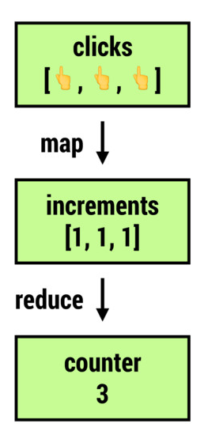
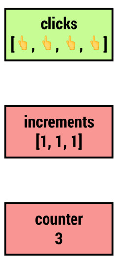
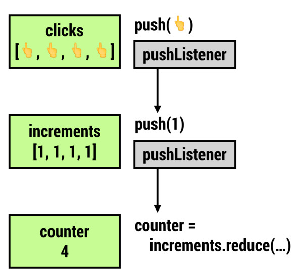
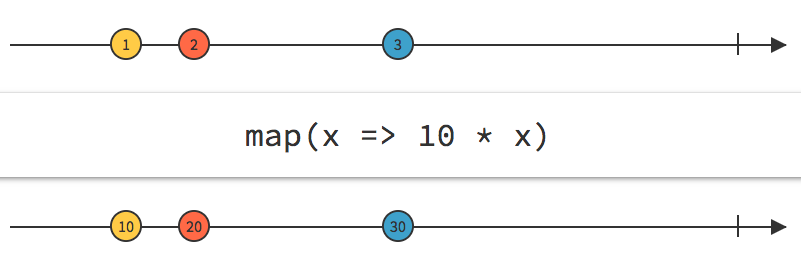

# Observable

## 引子

假设我们有一个 `clicks` 数组，它存储了来自页面上的三次鼠标点击行为：

```javascript
const clicks = [ MouseEvent, MouseEvent, MouseEvent ];
```

我们想统计点击总数：

```javascript
const toOne = (e) => 1;
const increments = clicks.map(toOne); // => [1, 1, 1]
const counter = increments.reduce((x, y) => x + y, 0); // => 3
```

从另外一个角度看，我们可以把 `click`、`increments`、`counter` 都看作数据，`click` 数据将产生 `increments`，`increments` 将产生 `counter`。

<div style="text-align:center">
  </img>
</div>

之后，新到来一个鼠标点击事件：

```javascript
clicks.push(new MouseEvent(null));
```

很遗憾，我们的 `increments` 和 `counter` 都不会做出 **响应**，他们还是保持了原值：

```javascript
console.log('increments', increments); // => increments [1, 1, 1]
console.log('counter', counter); // => counter 3
```

我们把 `clicks` 看做 **数据源** 的话，当前的窘境就可以描述为：数据（`increments`、`counter`）没有随着数据源的更新而更新：

<div style="text-align:center">
  </img>
</div>

针对这个窘境，我们可以为 `click` 绑定 `push` 事件回调，在回调中通知 `increments` 进行更新：

```javascript
click.addOnPushListener(e => increments.push(toOne(e)));
increments.addOnPushListener(e => { counter = increments.reduce((x, y) => x + y, 0); });
```

<div style="text-align:center">
  </img>
</div>

遗憾的是，JavaScript 并没有为我们提供 `Array.prototype.addOnPushListener` 方法。但是思路我们有了，一定要 **观察** 各个数据，并在各个数据更新的时候联动更新其他数据。

## 可观察对象

我们知道，要想让数据自动的联动起来，我们需要把数据定义为可观察对象，为此，引入了下面的两个定义：

- **Observable**： 可观察对象，不是 **静止** 的对象，而是随时间 **涌动的流**，它不断的发出值。

- **Observer**：观察者，当某个可观察对象绑定了某个观察者后，则该可观察对象将受到观察者的密切监控。每当流掀起波澜（产生值）时，观察者都能做出反应，并且，不同的观察者可能有不同的反应。

Observable 能够发出三种类型的数据：

- **value**：数据
- **error**：错误
- **complete signal**：完成信号

据此，Observer 也就需要针对三种数据进行不同的反应：

- 观察到 Observable 中有值产生时做出的反应。
- 观察到 Observable 产生错误时的反映。
- 观察到 Observable 停止生产值时做出的反应。

假设我们有用 JavaScript 就可以描述如下：

## 简单的 Observable 实现

假定我们有一个数组数据源 `[1, 2, 3]`，我们将它设计成为 Observable：

```js
const observable = observer => {
  [1, 2, 3].forEach(e => observer.next(e));
  observer.complete();
};

// 让一个 Observer 订阅这个 Observable
observable({
  next: data => console.log(data),
  error: error => console.error(error),
  complete: () => console.log('complete')
});

// 程序输出：
// 1
// 2
// 3
// complete
```

这种实现下，Observable 是一个方法，它接收一个 Observer 对其进行观察。接下来，我们将 Observable 实现为对象，它提供一个 `subscribe(observer)` 给不同的观察者订阅它：

```js
const observable = {
  subscribe: observer => {
    [1, 2, 3].forEach(e => observer.next(e));
    observer.complete();
  }
};

observable.subscribe({
  next: data => console.log(data),
  error: error => console.error(error),
  complete: () => console.log('complete')
});
```

更进一步，我们写一个创建器来创建不同类型的 Observable：

```js
const createObservable = subscribe => ({subscribe});

const clickObservable = createObservable(
  observer => documents.addEventListener('click', observer.next)
);

const arrayObservable = createObservable(
  observer => {
    [1, 2, 3].forEach(observer.next);
    observer.complete();
  }
);
```

## operator

假设我们有一个 Observable：`Observable([1, 2, 3])`，我们在观察它的时候，想要让其中的数都翻 10 倍，并且获得一个新的 Observable：`Observable([10, 20, 30])`。如何由一个 Observable 生成另一个 Observable 呢，需要引入 operator（运算符），下面我们先创建一个 map operator：

<div style="text-align:center">
  </img>
</div>

```js
const map = function (transformFn) {
  const inputObservable = this;
  const outputObservable = createObservable(
    observer => {
      inputObservable.subscribe({
        next: value => observer.next(transformFn(x)),
        error: observer.error,
        complete: observer.complete
      });
    }
  );
  return outputObservable;
};
```

并且把 map operator 提供给每一个 Observable 对象：

```js
const createObservable = subscribe => ({
  subscribe,
  map
});
```

测试一下：

```js
const double = x => 10 * x;
arrayObservable.map(double).subscribe({
  next: value => console.log(value)
});

// 程序输出:
// 10
// 20
// 30
```

运算符能帮我们不断从一个 Observable 创建另一个 Observable，也就是不断从一个流获得新的流。不只 map，我们还可以创建 filter，reduce 等等的 operator。

## 参考资料

- [You will learn RxJS at ng-europe 2016](https://www.youtube.com/watch?v=uQ1zhJHclvs)
- [Cycle.js and functional reactive user interfaces](https://www.youtube.com/watch?v=uNZnftSksYg)
