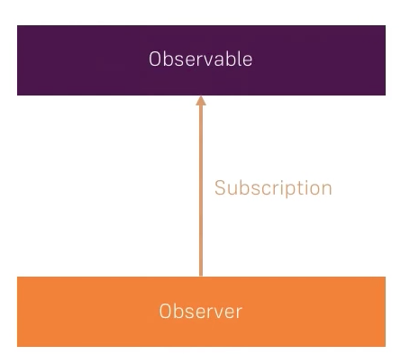
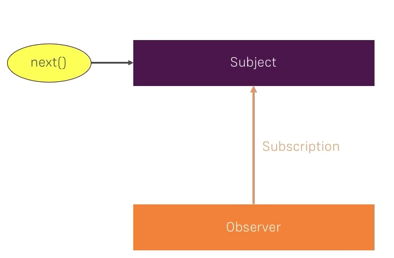

# Subject

上节中的 Observable 是被动形态的，它被绑定到了数组，HTTP 请求，DOM 事件等等，我们无法直接用 Observable 来发出值。

<div style="text-align: center">
  </img>
</div>

有时候我们有这样的需求，为一个可观察对象注册多个观察者，当有新数据到来的时候，可观察对象能够主动地发出值，然后让所有注册了的观察者都能做出响应。这个模式很像 Node 中的 [EventEmitter](https://nodejs.org/api/events.html)，是一个广播形态。为了和 Observable 稍加区分，可以将这种可观察对象描述为一个主题 Subject：

<div style="text-align: center">
  </img>
</div>

```js
const Subject = function () {
  const observers = [];
  let completed = false;
  this.subscribe = function (observer) {
    observers.push(observer);
  };
  this.next = function (value) {
    !completed && observers.forEach(observer => observer.next(value));
  };
  this.error = function (error) {
    !completed && observers.forEach(observer => observer.error(error));
  };
  this.complete = function () {
    !completed && observers.forEach(observer => observer.complete());
    completed = true;
  }
};

```

对于一个 Subject 来说，它将维护一个 `observers` 状态，该状态保存了所有订阅了该主题的观察者。每当 Subject 有数据到来时，所有 Observer 都能获得响应：

```js
const subject = new Subject();

// 注册 Observer 1
subject.subscribe({
  next: value => console.log('[Observer 1]', value),
  error: error => console.error('[Observer 1]', error),
  complete: () => console.log('[Observer 1] completed')
});

// 注册 Observer 2
subject.subscribe({
  next: value => console.log('[Observer 2]', value),
  error: error => console.error('[Observer 2]', error),
  complete: () => console.log('[Observer 2] completed')
});

subject.next(1);
subject.next(2);
subject.error(new Error('error'));
subject.complete();

// 程序输出：
// [Observer 1] 1
// [Observer 2] 1
// [Observer 1] 2
// [Observer 2] 2
// [Observer 1] Error: error
// [Observer 2] Error: error
// [Observer 1] completed
// [Observer 2] completed
```

## 参考资料

- [RxJS SUBJECT (~EventEmitter) | RxJS TUTORIAL](https://www.youtube.com/watch?v=rdK92pf3abs)
